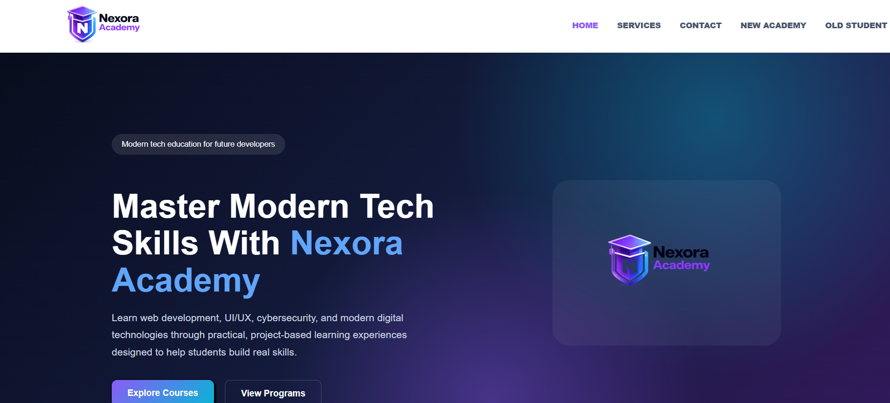

# Nexora Academy

Nexora Academy is a modern educational web platform built using **PHP**, **MySQL**, **HTML**, **CSS**, and **JavaScript**.

The project provides authentication features, responsive pages, and a clean user interface designed for online learning platforms.

---

## Features

* User Registration & Login System
* Secure Authentication
* Responsive Design
* Modern UI
* PHP Backend Functionality
* Organized File Structure
* Educational Platform Layout

---

## Technologies Used

* PHP
* MySQL
* HTML5
* CSS3
* JavaScript

---

## Project Structure

```text
Nexora Academy/
├── actions/
│   ├── login_action.php
│   └── register_action.php
├── media/
├── connection.php
├── index.php
├── login.php
├── logout.php
├── privatePage.php
├── register.php
├── style.css
├── privatePage.css
└── README.md
```

---
## Live Demo

🔗 Live Website: https://your-live-demo-link.com

## Preview



## Author

Developed by Mohammad Chebly.
